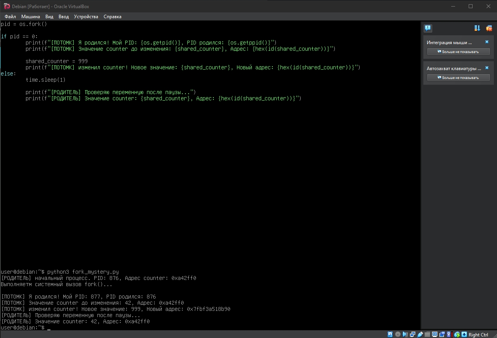
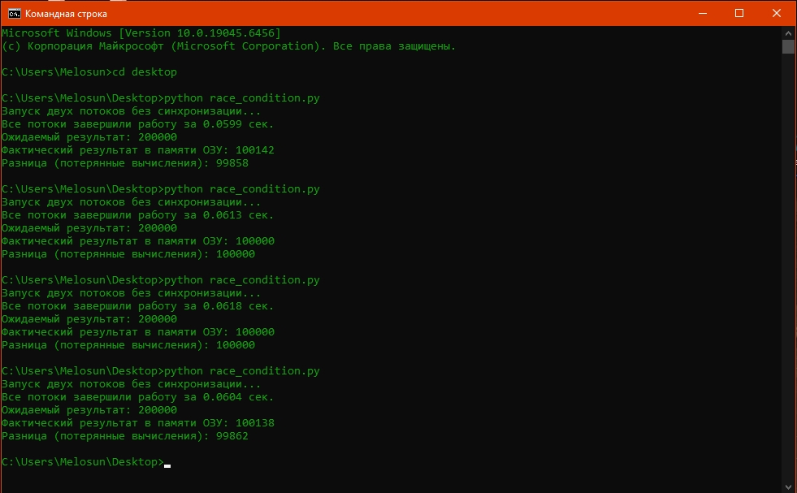

# Лабораторные работы по дисциплине «Системное программирование»

## Лабораторная работа №3: «Парадокс ветвления процессов и магия Copy-on-Write»
### Исходный код (`fork_mystery.py`):
```python
import os
import time

shared_counter = 42

print(f"[РОДИТЕЛЬ] Начальный процесс. PID: {os.getpid()}, Адрес counter: {hex(id(shared_counter))}")
print("Выполняем системный вызов fork()...\n")

pid = os.fork()

if pid == 0:
    print(f"[ПОТОМК] Я родился! Мой PID: {os.getpid()}, PID родителя: {os.getppid()}")
    print(f"[ПОТОМК] Значение counter до изменения: {shared_counter}, Адрес: {hex(id(shared_counter))}")
    shared_counter = 999
    print(f"[ПОТОМК] Изменил counter! Новое значение: {shared_counter}, Новый адрес: {hex(id(shared_counter))}")
else:
    time.sleep(1)
    print(f"[РОДИТЕЛЬ] Проверяю переменную после паузы...")
    print(f"[РОДИТЕЛЬ] Значение counter: {shared_counter}, Адрес: {hex(id(shared_counter))}")
```


### Ответы на контрольные вопросы:
1. **Виртуальные адреса:** Выводимый Python адрес `hex(id(...))` — это виртуальный адрес в памяти. У каждого процесса своя Таблица страниц (Page Table), а блок MMU транслирует виртуальные адреса в физические. При системном вызове `fork()` таблицы страниц клонируются, поэтому виртуальные адреса выглядят одинаковыми. Однако при изменении данных MMU перенаправляет адрес потомка на новую физическую страницу ОЗУ, сохраняя изоляцию.
2. **Copy-on-Write:** Физическое копирование страницы произошло в момент выполнения строки `shared_counter = 999`. Триггером послужила первая попытка записи (модификации) данных дочерним процессом (прерывание Page Fault).

---

## Лабораторная работа №4: «Экспериментальное доказательство состояния гонки (Race Condition)»
1 Код с демонстрацией Race Condition (race_condition.py):
```python
import threading
import time

shared_counter = 0
STEPS = 100000

def worker():
    global shared_counter
    for _ in range(STEPS):
        temp = shared_counter
        time.sleep(0)
        shared_counter = temp + 1

print("Запуск двух потоков без синхронизации...")
start_time = time.time()

t1 = threading.Thread(target=worker)
t2 = threading.Thread(target=worker)

t1.start()
t2.start()

t1.join()
t2.join()

print(f"Все потоки завершили работу за {time.time() - start_time:.4f} сек.")
print(f"Ожидаемый результат: {STEPS * 2}")
print(f"Фактический результат в памяти ОЗУ: {shared_counter}")
print(f"Разница (потерянные вычисления): {(STEPS * 2) - shared_counter}")
```
Результат:


2. Исправленный код с блокировкой (race_condition_fixed.py):
```python
import threading
import time

shared_counter = 0
STEPS = 100000

counter_lock = threading.Lock()

def worker():
    global shared_counter
    for _ in range(STEPS):
        with counter_lock:
            temp = shared_counter
            time.sleep(0)
            shared_counter = temp + 1

print("Запуск двух потоков С СИНХРОНИЗАЦИЕЙ (Lock)...")
start_time = time.time()

t1 = threading.Thread(target=worker)
t2 = threading.Thread(target=worker)

t1.start()
t2.start()

t1.join()
t2.join()

print(f"Все потоки завершили работу за {time.time() - start_time:.4f} сек.")
print(f"Ожидаемый результат: {STEPS * 2}")
print(f"Фактический результат в памяти ОЗУ: {shared_counter}")
print(f"Разница (потерянные вычисления): {(STEPS * 2) - shared_counter}")
```
Результат

### Ответы на контрольные вопросы:
1. **Сценарий Race Condition:**
   - Поток 1 считывает `shared_counter` из ОЗУ в регистр CPU (значение `100`).
   - Поток 1 увеличивает значение в регистре до `101`.
   - Происходит Context Switch (переключение контекста) планировщиком ОС, Поток 1 принудительно прерывается.
   - Поток 2 успевает прочитать из ОЗУ то же значение `100`, инкрементировать его и записать `101` в ОЗУ.
   - Поток 1 возобновляется и перезаписывает `101` из своего регистра поверх ОЗУ. В итоге один инкремент теряется.
2. **Замедление работы с Lock:**
   - На каждой итерации цикла расходуются ресурсы процессора на захват (`acquire`) и освобождение (`release`) мьютекса.
   - Блокировка превращает параллельное выполнение кода в последовательное: потоки вынуждены простаивать в ожидании освобождения ресурса.# laba3-4
